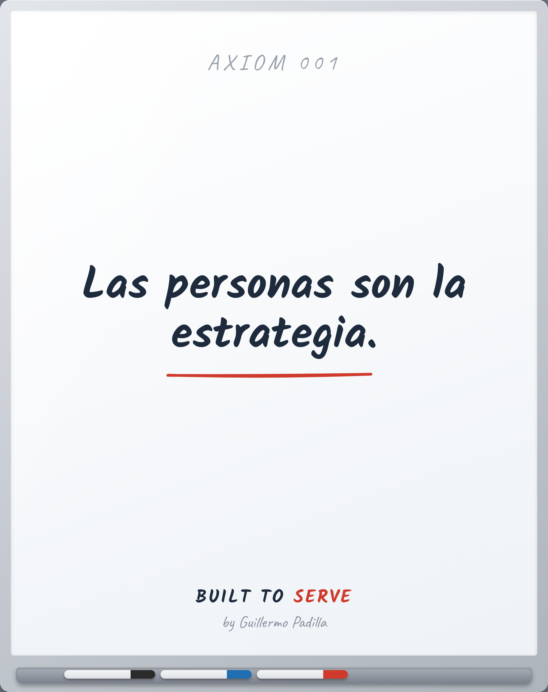

# AXIOM 001 — People are the strategy

> Las personas son la estrategia.

- **Canon:** Axiom 001  ·  (slug EN como ID: `People are the strategy`)
- **Tipo:** Axioma. Verdad fundacional — no se argumenta, se asume.
- **Inspira:** PRINCIPLE-001

## Qué afirma

Las personas no son un recurso para ejecutar la estrategia. Son la estrategia.

---
*Un Axioma es el cimiento. No es razonamiento desde primeros principios; es el
punto de partida de la filosofía Built to Serve. De él nacen los Principles
observables.*
