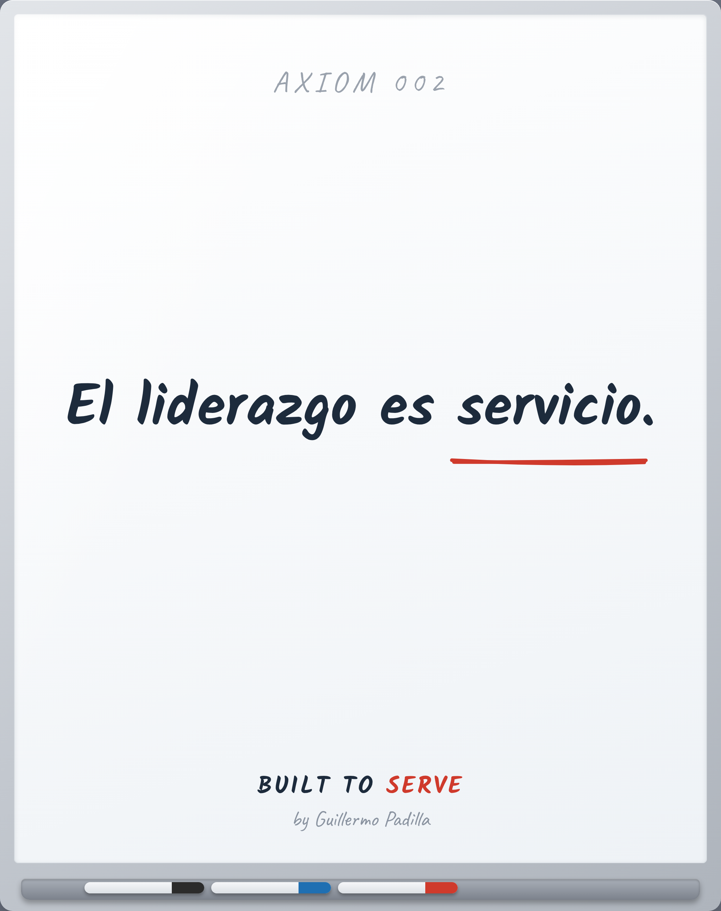

# AXIOM 002 — Leadership is service

> El liderazgo es servicio.

- **Canon:** Axiom 002  ·  (slug EN como ID: `Leadership is service`)
- **Tipo:** Axioma. Verdad fundacional — no se argumenta, se asume.
- **Inspira:** PRINCIPLE-004

## Qué afirma

El liderazgo no es autoridad ni cargo. Es servir de una forma que otros quieran seguir.

---
*Un Axioma es el cimiento. No es razonamiento desde primeros principios; es el
punto de partida de la filosofía Built to Serve. De él nacen los Principles
observables.*
