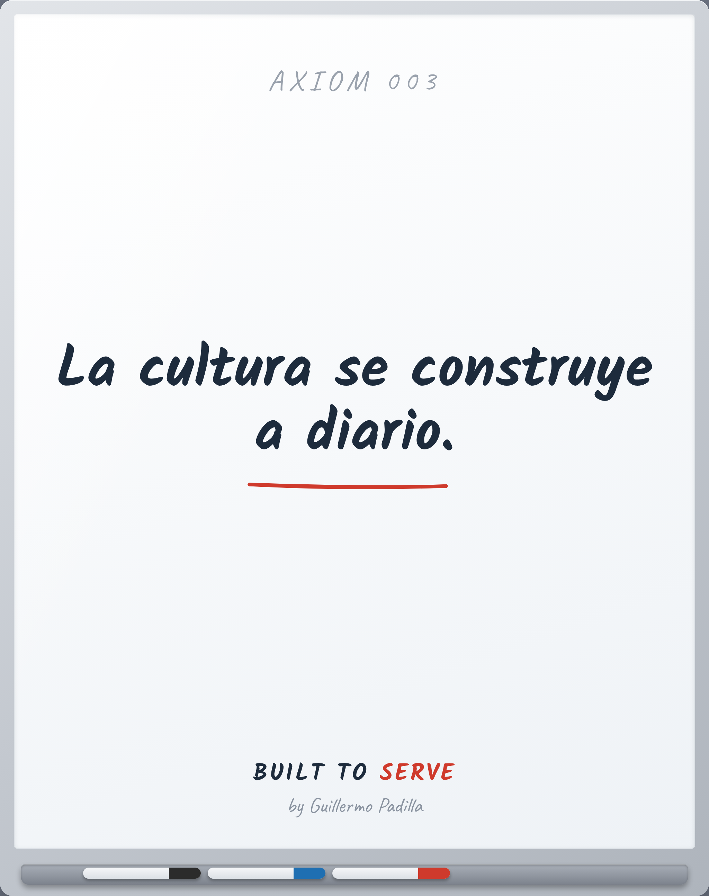

# AXIOM 003 — Culture is built daily

> La cultura se construye a diario.

- **Canon:** Axiom 003  ·  (slug EN como ID: `Culture is built daily`)
- **Tipo:** Axioma. Verdad fundacional — no se argumenta, se asume.
- **Inspira:** PRINCIPLE-001, PRINCIPLE-003

## Qué afirma

La cultura no es lo que está escrito en la pared. Es lo que se repite cada día.

---
*Un Axioma es el cimiento. No es razonamiento desde primeros principios; es el
punto de partida de la filosofía Built to Serve. De él nacen los Principles
observables.*
