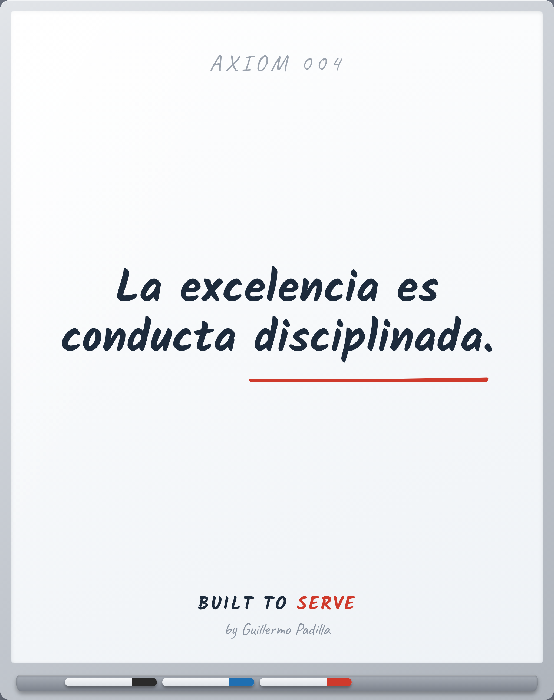

# AXIOM 004 — Excellence is disciplined behavior

> La excelencia es conducta disciplinada.

- **Canon:** Axiom 004  ·  (slug EN como ID: `Excellence is disciplined behavior`)
- **Tipo:** Axioma. Verdad fundacional — no se argumenta, se asume.
- **Inspira:** PRINCIPLE-002

## Qué afirma

La excelencia no es talento ni suerte. Es conducta disciplinada, repetida.

---
*Un Axioma es el cimiento. No es razonamiento desde primeros principios; es el
punto de partida de la filosofía Built to Serve. De él nacen los Principles
observables.*
