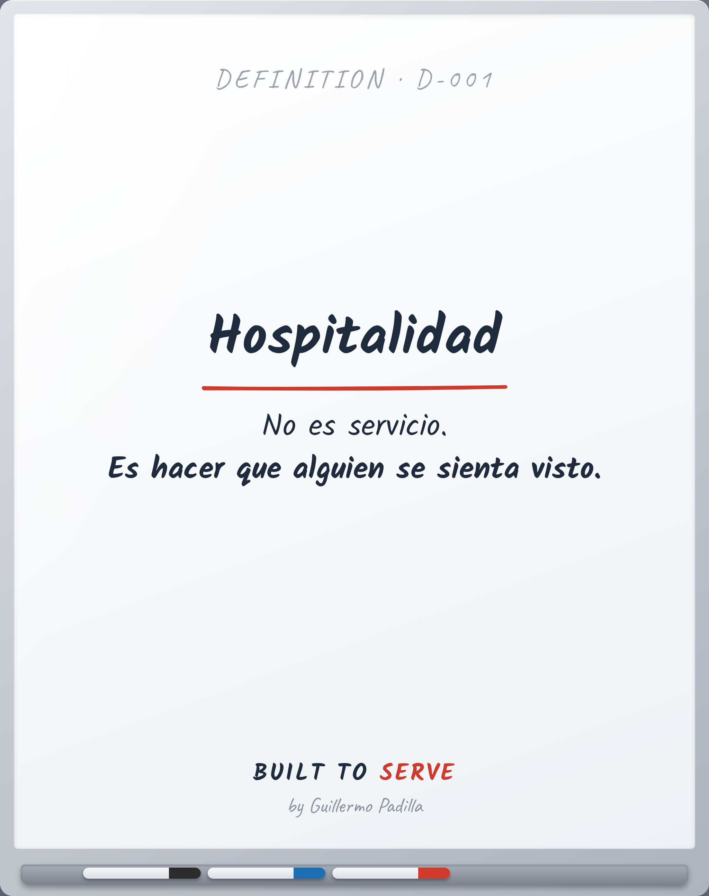

# DEFINITION D-001 — Hospitalidad

> No es servicio. Es hacer que alguien se sienta visto.

- **Canon:** Definition D-001
- **Palabra (ES):** Hospitalidad  ·  **(EN):** Hospitality

## Definición oficial Built to Serve

**Hospitalidad:** No es servicio. Es hacer que alguien se sienta visto.

---
*Las palabras importan. Quien controla el lenguaje, controla la filosofía.*
