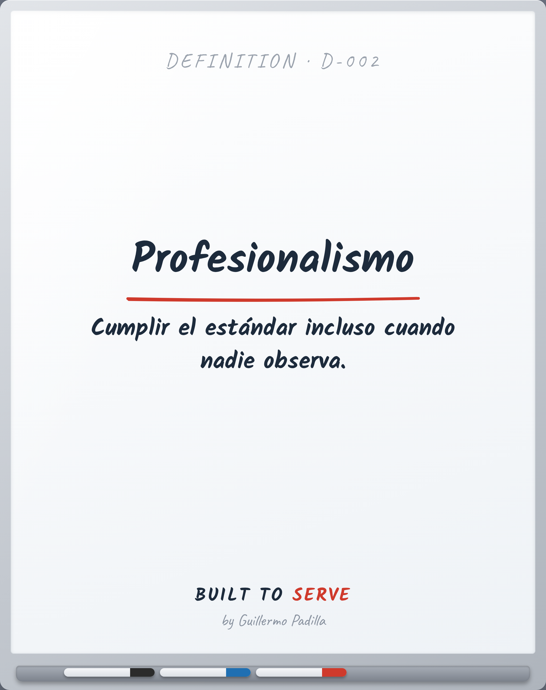

# DEFINITION D-002 — Profesionalismo

> Cumplir el estándar incluso cuando nadie observa.

- **Canon:** Definition D-002
- **Palabra (ES):** Profesionalismo  ·  **(EN):** Professionalism

## Definición oficial Built to Serve

**Profesionalismo:** Cumplir el estándar incluso cuando nadie observa.

---
*Las palabras importan. Quien controla el lenguaje, controla la filosofía.*
