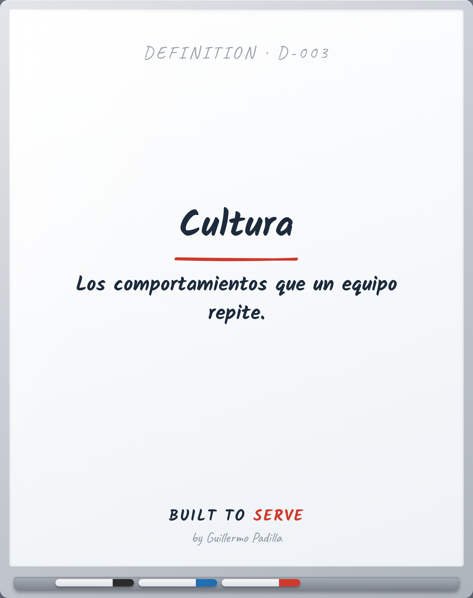

# DEFINITION D-003 — Cultura

> Los comportamientos que un equipo repite.

- **Canon:** Definition D-003
- **Palabra (ES):** Cultura  ·  **(EN):** Culture

## Definición oficial Built to Serve

**Cultura:** Los comportamientos que un equipo repite.

---
*Las palabras importan. Quien controla el lenguaje, controla la filosofía.*
