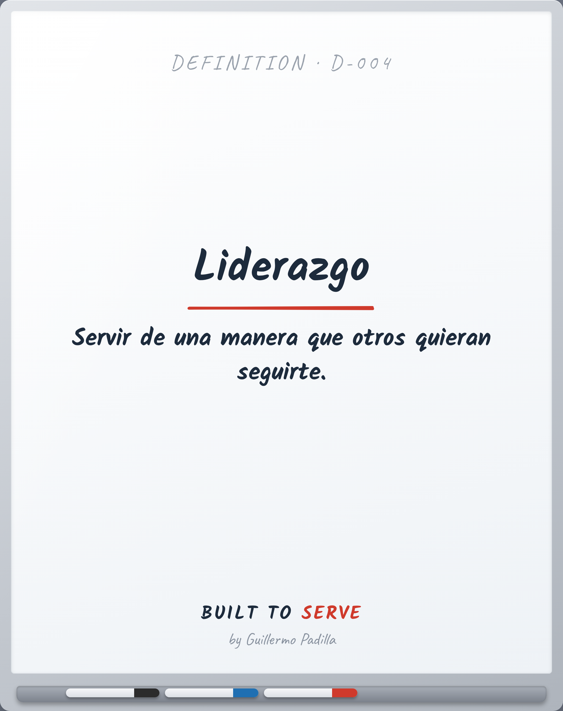

# DEFINITION D-004 — Leadership

> Servir de una manera que otros quieran seguirte.

- **Canon:** Definition D-004
- **Palabra (ES):** Leadership  ·  **(EN):** Leadership

## Definición oficial Built to Serve

**Leadership:** Servir de una manera que otros quieran seguirte.

---
*Las palabras importan. Quien controla el lenguaje, controla la filosofía.*
