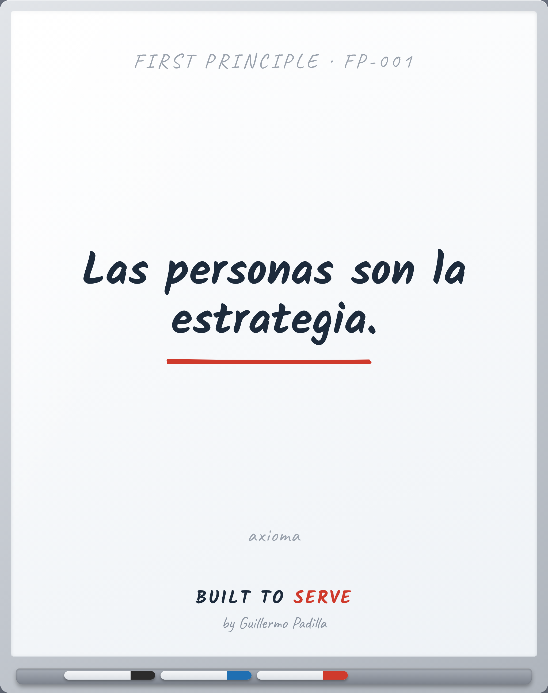

# FIRST PRINCIPLE FP-001 — People are the strategy

> Las personas son la estrategia.

- **Canon:** First Principle FP-001
- **Tipo:** Axioma. No se enseña, se asume.
- **De aquí derivan:** Principle 001

## Qué afirma

Las personas no son un recurso para ejecutar la estrategia. Son la estrategia.

---
*Un First Principle es una verdad irreductible. No se argumenta en cada pieza;
es el cimiento del que nacen los Principles observables.*
