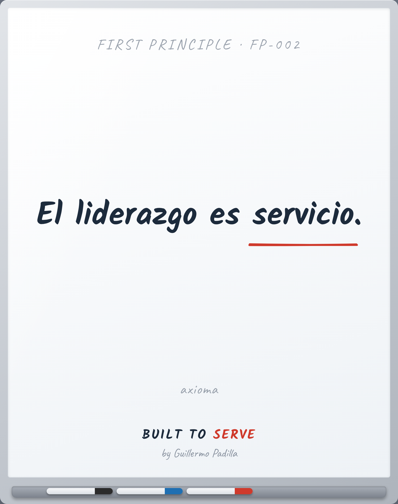

# FIRST PRINCIPLE FP-002 — Leadership is service

> El liderazgo es servicio.

- **Canon:** First Principle FP-002
- **Tipo:** Axioma. No se enseña, se asume.
- **De aquí derivan:** Principle 004 · Mental Model 002

## Qué afirma

El liderazgo no es autoridad ni cargo. Es servir de una forma que otros quieran seguir.

---
*Un First Principle es una verdad irreductible. No se argumenta en cada pieza;
es el cimiento del que nacen los Principles observables.*
