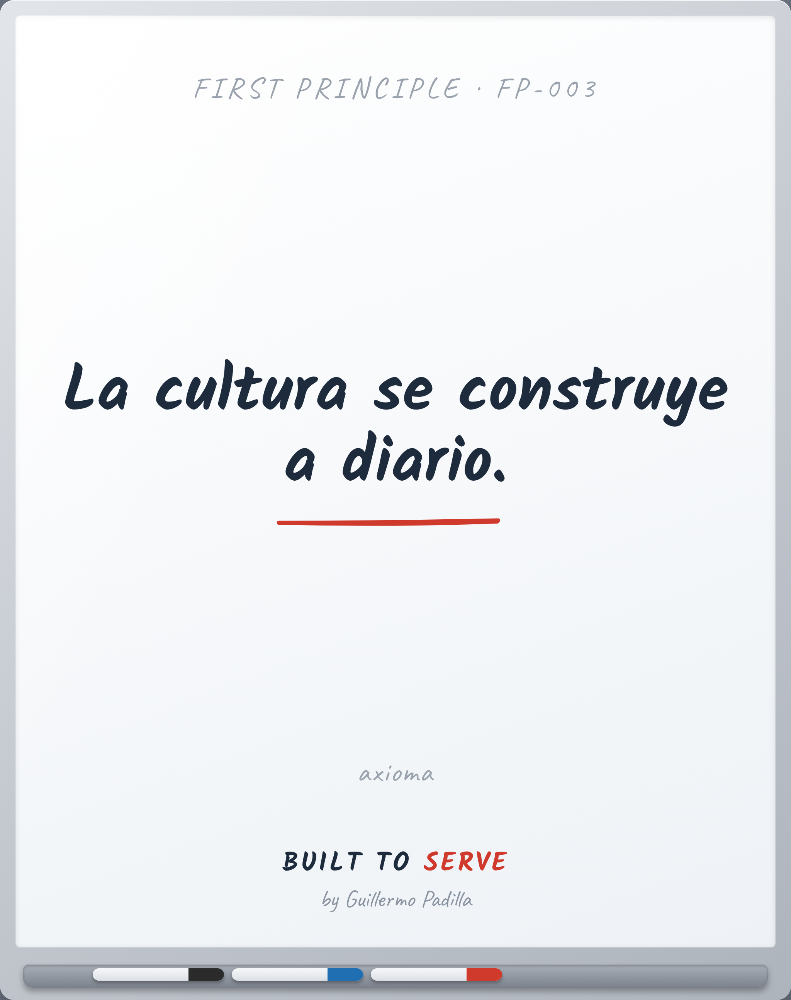

# FIRST PRINCIPLE FP-003 — Culture is built daily

> La cultura se construye a diario.

- **Canon:** First Principle FP-003
- **Tipo:** Axioma. No se enseña, se asume.
- **De aquí derivan:** Principle 001 · Principle 003

## Qué afirma

La cultura no es lo que está escrito en la pared. Es lo que se repite cada día.

---
*Un First Principle es una verdad irreductible. No se argumenta en cada pieza;
es el cimiento del que nacen los Principles observables.*
