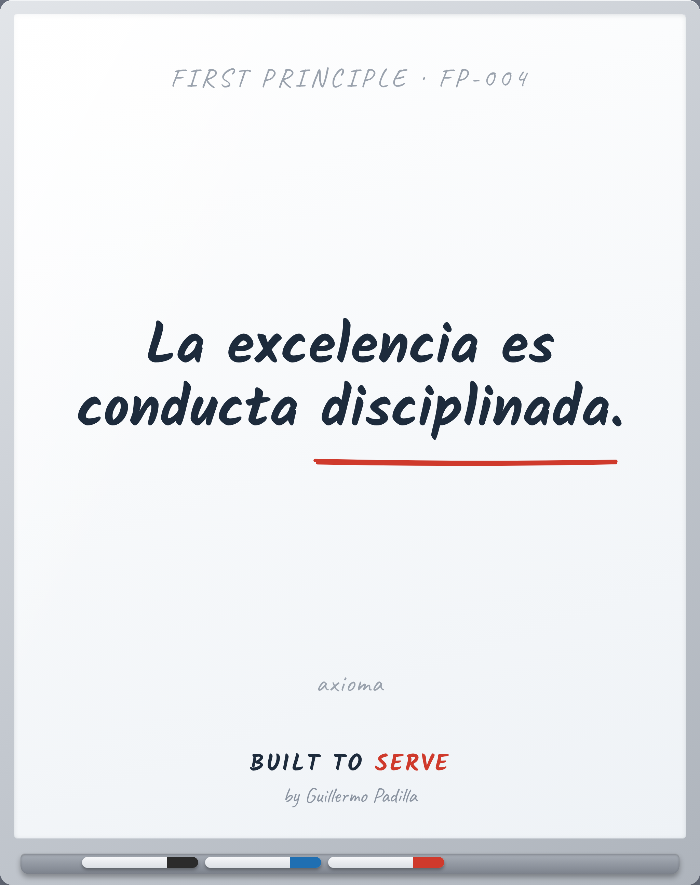

# FIRST PRINCIPLE FP-004 — Excellence is disciplined behavior

> La excelencia es conducta disciplinada.

- **Canon:** First Principle FP-004
- **Tipo:** Axioma. No se enseña, se asume.
- **De aquí derivan:** Principle 002

## Qué afirma

La excelencia no es talento ni suerte. Es conducta disciplinada, repetida.

---
*Un First Principle es una verdad irreductible. No se argumenta en cada pieza;
es el cimiento del que nacen los Principles observables.*
