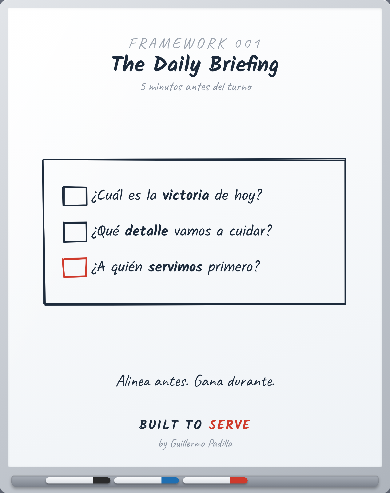

# FRAMEWORK FW-001 — The Daily Briefing

> Framework: explica un proceso repetible.

- **Canon:** Framework FW-001
- **Qué es:** La rutina de 5 minutos antes del turno que alinea al equipo.

## El proceso

Tres preguntas, antes de cada turno:
1. ¿Cuál es la victoria de hoy?
2. ¿Qué detalle vamos a cuidar?
3. ¿A quién servimos primero?

No es una junta. Es una alineación. El equipo que se alinea antes, gana durante.

## Caption (LinkedIn · ES)

La mayoría de los equipos entra al turno a reaccionar.
Los mejores entran a ejecutar un plan.

La diferencia son 5 minutos antes de empezar.

Tres preguntas, todos los días:
1. ¿Cuál es la victoria de hoy?
2. ¿Qué detalle vamos a cuidar?
3. ¿A quién servimos primero?

¿Tu equipo entra a reaccionar o a ejecutar?
#Liderazgo #Operaciones #BuiltToServe
