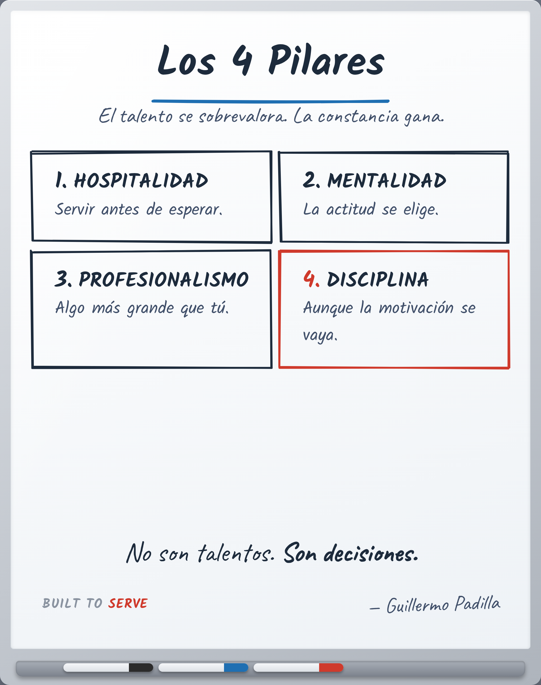

# FRAMEWORK 001 — The Four Pillars

> Herramienta, no principio. Cómo se aplica una verdad.

- **Canon:** Framework 001
- **Qué es:** El modelo base de Built to Serve: Hospitalidad, Mentalidad, Profesionalismo, Disciplina.
- **Estado:** Gráfico hecho

## Descripción

Las cuatro decisiones sobre las que se para cualquier gran profesional. No son talentos; son decisiones que se vuelven a tomar cada día.

---
