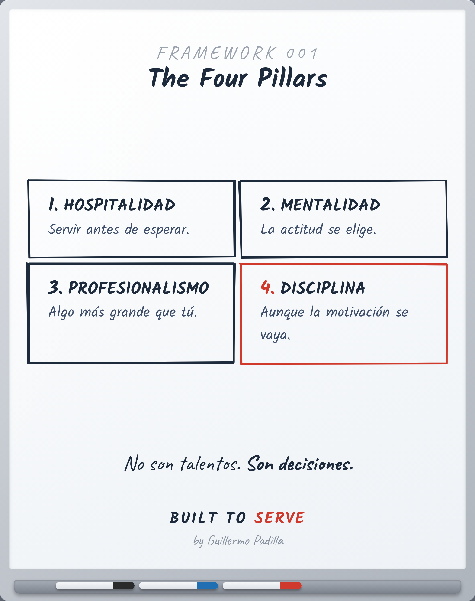

# FRAMEWORK 001 — The Four Pillars

> Herramienta, no principio. Cómo se aplica una verdad.

- **Canon:** Framework 001
- **Qué es:** El modelo base — Hospitalidad, Mentalidad, Profesionalismo, Disciplina.
- **Estado:** Gráfico hecho
- **Idioma:** nombre canónico en inglés (The Four Pillars); contenido en español.

## Descripción

Las cuatro decisiones sobre las que se para cualquier gran profesional. No son
talentos; son decisiones que se vuelven a tomar cada día.

1. **Hospitalidad** — Servir antes de esperar.
2. **Mentalidad** — La actitud se elige.
3. **Profesionalismo** — Algo más grande que tú.
4. **Disciplina** — Aunque la motivación se vaya.

## Caption (LinkedIn · ES)

El talento está sobrevalorado.
La motivación se acaba el martes.

La gente en la que más confío se para sobre cuatro cosas:

1. Hospitalidad — servir antes de esperar.
2. Mentalidad — la actitud se elige.
3. Profesionalismo — representas algo más grande que tú.
4. Disciplina — hazlo aunque la motivación ya no esté.

No son talentos. Son decisiones que vuelves a tomar mañana.

¿Cuál pilar es tu más fuerte? ¿Cuál has estado evitando?

#Liderazgo #Profesionalismo #Disciplina #BuiltToServe
