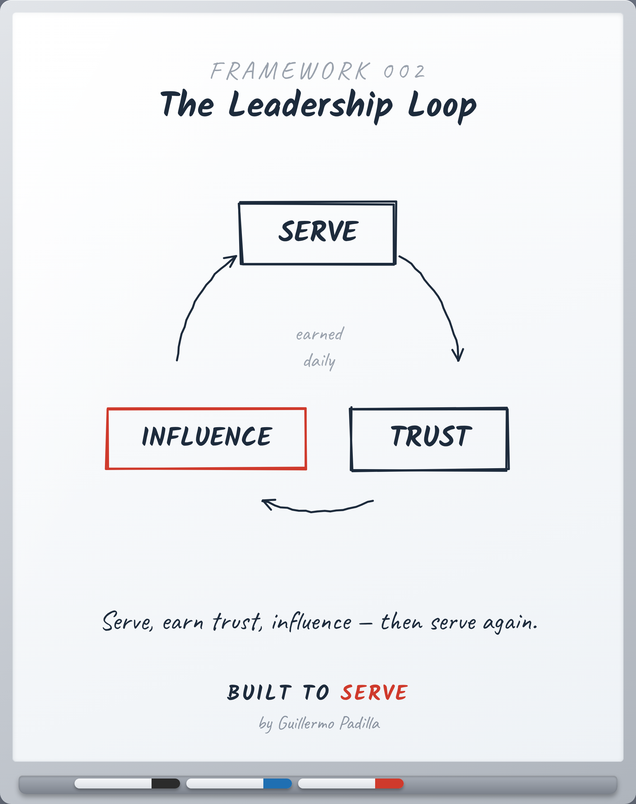

# FRAMEWORK 002 — The Leadership Loop

> Herramienta, no principio. Cómo se aplica una verdad.

- **Canon:** Framework 002
- **Qué es:** Un ciclo, no una línea: Serve → Trust → Influence → (vuelve a) Serve.
- **Estado:** Gráfico hecho

## Descripción

El liderazgo no es una escalera que se sube una vez. Es un ciclo que se gana
cada día: sirves, eso construye confianza, la confianza te da influencia, y la
influencia se usa para volver a servir — mejor.

## Caption (LinkedIn · ES)

> Voz: abre con una verdad universal sobre el lector.

Muchos creen que el liderazgo es un punto al que se llega.

No es un punto. Es un ciclo.

Sirves → ganas confianza.
La confianza → te da influencia.
Y la influencia se usa para volver a servir.

El día que dejas de servir, el ciclo se rompe — y la influencia se apaga.

Por eso el liderazgo no se conquista una vez. Se gana cada día.

¿En qué parte del ciclo estás hoy?

#Liderazgo #Servicio #BuiltToServe
