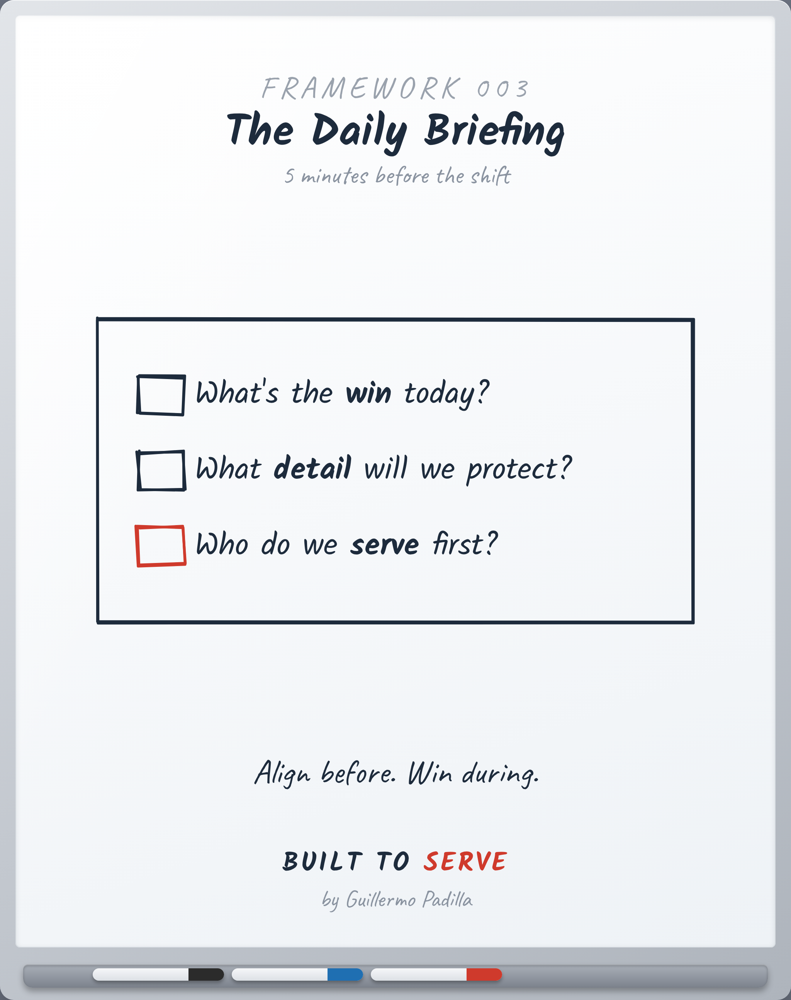

# FRAMEWORK 003 — The Daily Briefing

> Herramienta, no principio. Cómo se aplica una verdad.

- **Canon:** Framework 003
- **Qué es:** La rutina de 5 minutos antes del turno que alinea al equipo.
- **Estado:** Gráfico hecho

## Descripción

Tres preguntas antes de cada turno. Cinco minutos. El equipo que se alinea
antes, gana durante.

1. What's the win today?
2. What detail will we protect?
3. Who do we serve first?

## Caption (LinkedIn · ES)

> Voz: abre con una verdad universal sobre el lector.

La mayoría de los equipos entra al turno a reaccionar.
Los mejores entran a ejecutar un plan.

La diferencia son 5 minutos antes de empezar.

Tres preguntas, todos los días:
1. ¿Cuál es la victoria de hoy?
2. ¿Qué detalle vamos a cuidar?
3. ¿A quién servimos primero?

No es una junta. Es una alineación.
El equipo que se alinea antes, gana durante.

¿Tu equipo entra a reaccionar o a ejecutar?

#Liderazgo #Operaciones #BuiltToServe
