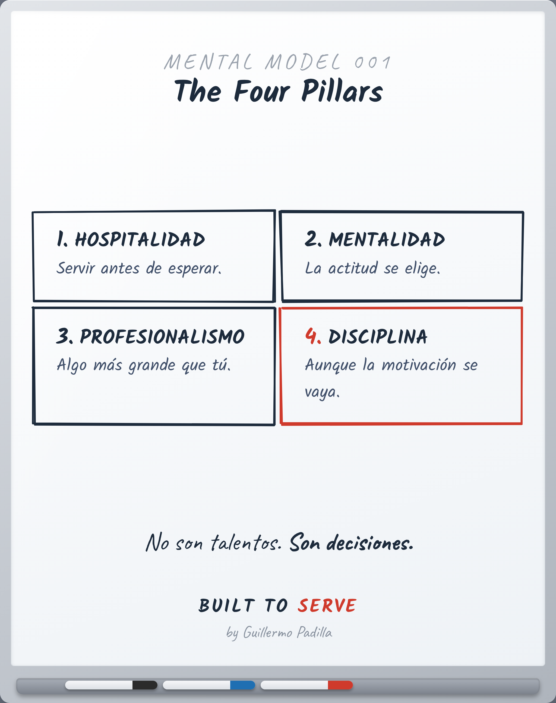

# MENTAL MODEL MM-001 — The Four Pillars

> Modelo mental: no es una herramienta, es una forma de pensar.

- **Canon:** Mental Model MM-001
- **Qué cambia:** Una forma de ver: sobre qué se para un gran profesional.

## Descripción

Hospitalidad · Mentalidad · Profesionalismo · Disciplina. No son talentos; son decisiones.

## Caption (LinkedIn · ES)

El talento está sobrevalorado.
La motivación se acaba el martes.

La gente en la que más confío se para sobre cuatro cosas:

Hospitalidad — servir antes de esperar.
Mentalidad — la actitud se elige.
Profesionalismo — representas algo más grande que tú.
Disciplina — hazlo aunque la motivación ya no esté.

No son talentos. Son decisiones que vuelves a tomar mañana.

No tienes que ser el más talentoso del lugar. El más constante, sí.

¿Cuál pilar es tu más fuerte? ¿Cuál has estado evitando?

#Liderazgo #Profesionalismo #Disciplina #BuiltToServe

---
*Un Mental Model cambia cómo alguien piensa. Un Framework explica un proceso.*
