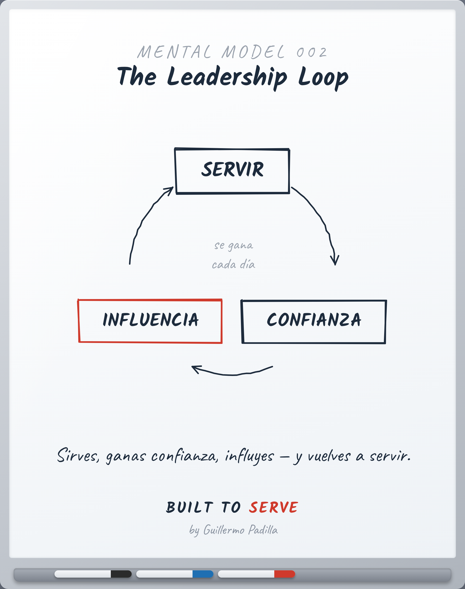

# MENTAL MODEL MM-002 — The Leadership Loop

> Modelo mental: no es una herramienta, es una forma de pensar.

- **Canon:** Mental Model MM-002
- **Qué cambia:** Una forma de ver el liderazgo: un ciclo, no una línea.

## Descripción

Servir → Confianza → Influencia → volver a servir. Se gana cada día.

---
*Un Mental Model cambia cómo alguien piensa. Un Framework explica un proceso.*
