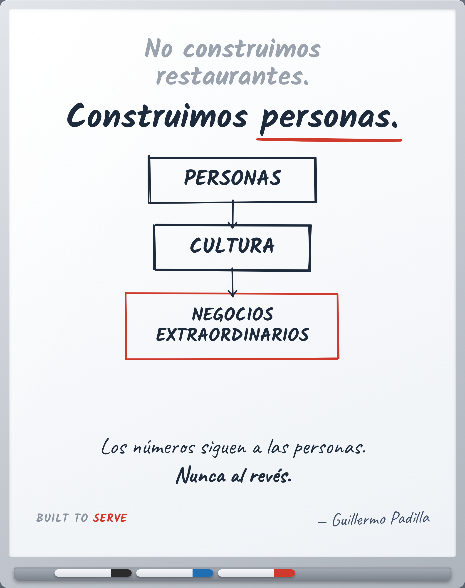

<!--
LinkedIn Post 1 de 3 — La Filosofía  (versión corta, español)
Parte I Fundamentos / Capítulo: Propósito / Pilar: Hospitalidad
Principio: No construimos restaurantes. Construimos personas.

CONCEPTO GRÁFICO (imagen 1:1 o 4:5):
  Fondo oscuro, tipografía blanca grande, mucho espacio.
  Solo 4 líneas centradas:
    "No construimos restaurantes.
     Construimos personas.
     Las personas construyen cultura.
     La cultura construye negocios extraordinarios."
  Abajo, pequeño: BUILT TO SERVE
-->

# Post 1 — Built to Serve / Manifiesto (ES, corto)

> Voz The Philosopher: abrir con una verdad universal sobre el lector.
> La historia personal va después, nunca al inicio.

La mayoría de los líderes intenta arreglar el negocio.

Pocos entienden que un negocio nunca se arregla directamente.
Se transforma a través de las personas.

Los negocios no crean cultura.
Las personas sí.

Un negocio no es un edificio ni un menú.
Es un grupo de personas haciendo lo mismo, una y otra vez.

Cambia a quién desarrollas y lo cambias todo.

Si quieres un mejor negocio, no empieces por el negocio.
Empieza por la gente que lo carga.

(Yo tardé años en entenderlo. Quise arreglar el negocio antes que a mí mismo.
No cambió hasta que cambié yo.)

Los números siguen a las personas. Nunca al revés.

—

El primero de muchos. Sígueme si esto también es tu trabajo.

#Hospitalidad #Liderazgo #Cultura #BuiltToServe

<!--
VARIANTES DE HOOK (verdad universal primero, nunca "yo"):
  A) "La mayoría de los líderes intenta arreglar el negocio. Casi nadie lo logra directamente."
  B) "Los negocios no crean cultura. Las personas sí."
  C) "Los números siguen a las personas. Nunca al revés."
-->
