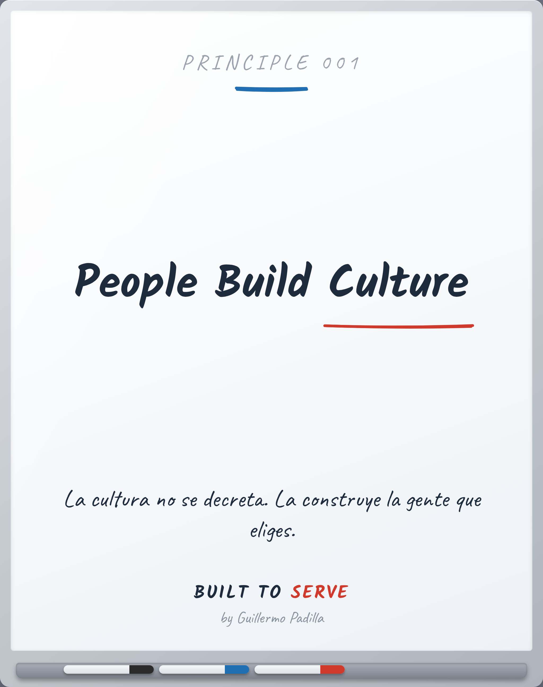

# PRINCIPLE 001 — People Build Culture

> *People Build Culture*
> La cultura no se decreta. La construye la gente que eliges.

- **Canon:** Principle 001
- **Pilar:** Hospitalidad
- **Parte:** I Fundamentos (Cultura)
- **Estado:** Publicable

## Caption (LinkedIn · ES)

La cultura no se escribe en la pared.
La construye la gente que dejas entrar.

Contrata por carácter.
Forma por hábito.
Cuida a quien ya vive los valores.

Cada persona que sumas mueve la cultura — para bien o para mal.

¿La última persona que contrataste subió el estándar… o lo bajó?

#Cultura #Liderazgo #BuiltToServe

---

<!-- Las siete puertas: 1 Atemporal · 2 Práctico · 3 Enseñable ·
4 Consistente · 5 Mejores líderes · 6 Mejores profesionales · 7 Importa en 10 años -->
