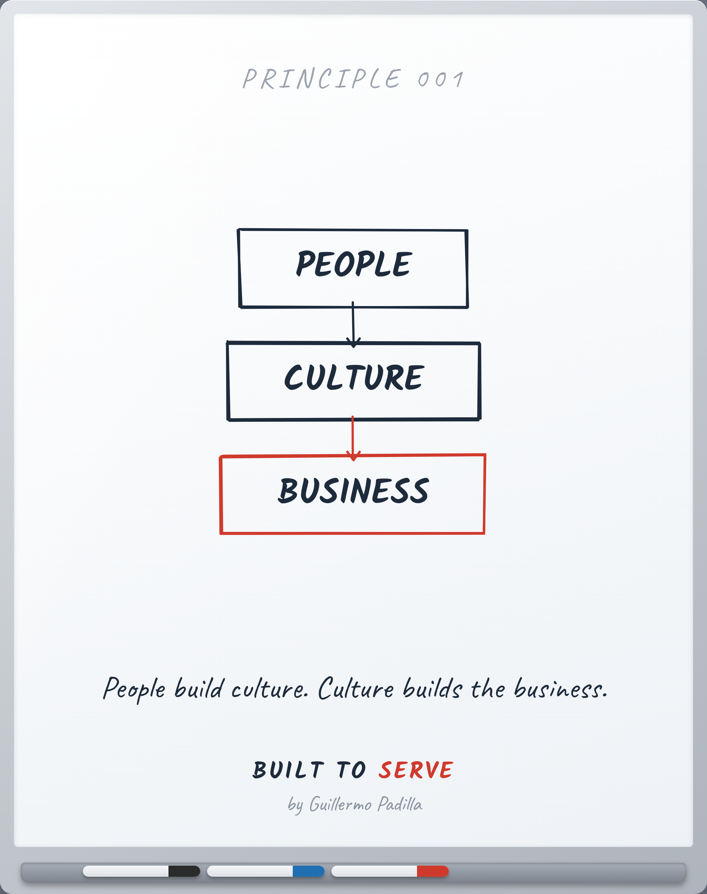

# PRINCIPLE 001 — Personas → Cultura → Negocio

> Las personas construyen cultura. La cultura construye el negocio.

- **Canon:** Principle 001
- **Nace de:** FP-001 (Las personas son la estrategia)
- **Pilar:** Hospitalidad
- **Parte:** I Fundamentos (Cultura)
- **Representación visual:** whiteboard del mismo número (nodos en inglés, resumen en español)

## Caption (LinkedIn · ES)

> Voz: abre con una verdad universal sobre el lector. La historia personal,
> si la hay, va después.

La mayoría de los líderes intenta arreglar el negocio.

Pocos entienden que un negocio nunca se arregla directamente.
Se transforma a través de las personas.

Los negocios no crean cultura.
Las personas sí.
Y la cultura es la que, con el tiempo, construye el negocio.

Por eso perseguir el número rara vez funciona:
estás trabajando en el resultado, no en su causa.

¿Estás trabajando en tu negocio, o en la gente que lo construye?

#Cultura #Liderazgo #BuiltToServe

---

<!-- The Principle Test: 1 Atemporal · 2 Experiencia real · 3 Enseñable ·
4 Dibujable en pizarra · 5 Resumible en una frase · 6 Mejores profesionales ·
7 Fortalece Built to Serve -->
