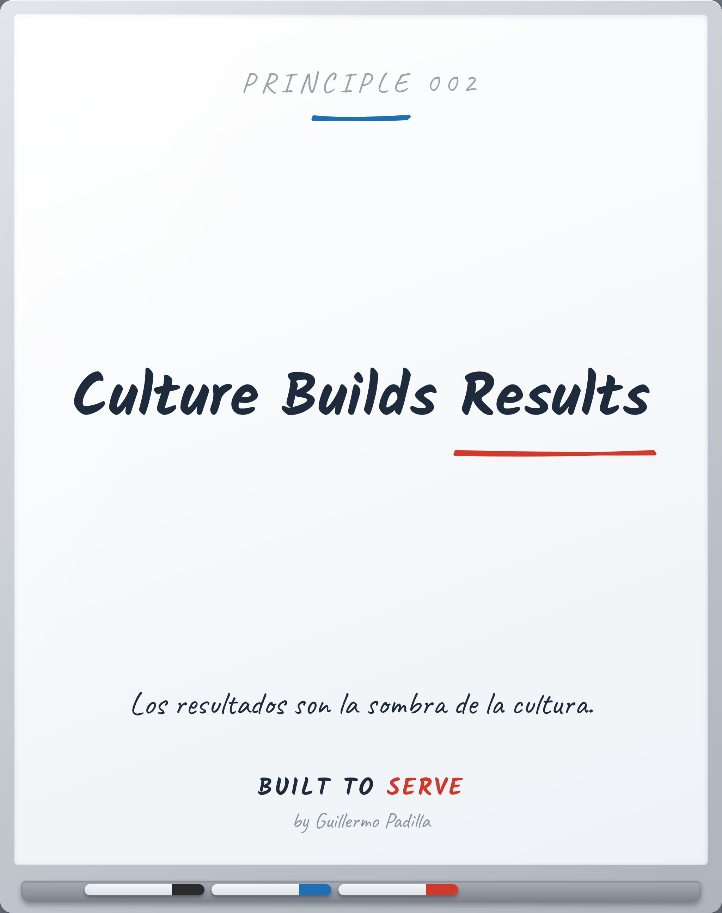

# PRINCIPLE 002 — Culture Builds Results

> *Culture Builds Results*
> Los resultados son la sombra de la cultura.

- **Canon:** Principle 002
- **Pilar:** Mentalidad
- **Parte:** I Fundamentos / IV Operaciones
- **Estado:** Publicable

## Caption (LinkedIn · ES)

Todos quieren los resultados.
Pocos cuidan lo que los produce.

Los resultados son la sombra de la cultura.
Mueve la cultura y la sombra se mueve sola.

Por eso perseguir el número rara vez funciona:
persigues la sombra, no el cuerpo.

¿Trabajas en los resultados, o en lo que los crea?

#Cultura #Resultados #BuiltToServe

---

<!-- Las siete puertas: 1 Atemporal · 2 Práctico · 3 Enseñable ·
4 Consistente · 5 Mejores líderes · 6 Mejores profesionales · 7 Importa en 10 años -->
