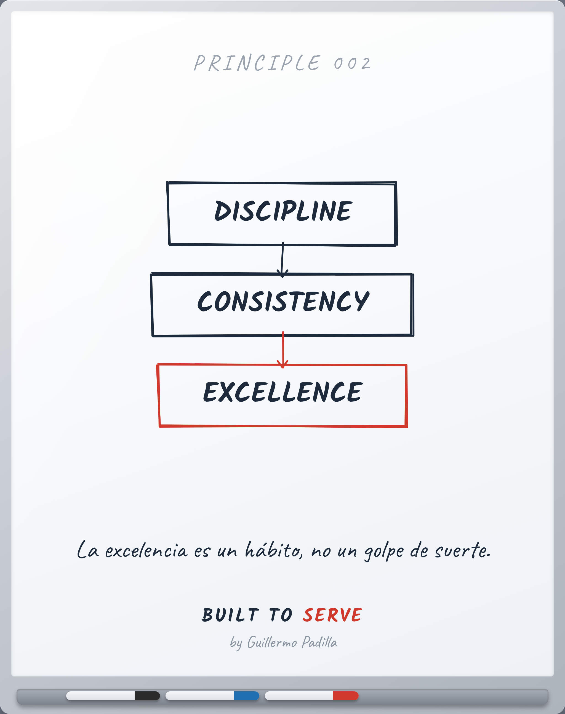

# PRINCIPLE 002 — Disciplina → Constancia → Excelencia

> La excelencia es un hábito, no un golpe de suerte.

- **Canon:** Principle 002
- **Nace de:** FP-004 (La excelencia es conducta disciplinada)
- **Pilar:** Disciplina
- **Parte:** V Crecimiento Personal
- **Representación visual:** whiteboard del mismo número (nodos en inglés, resumen en español)

## Caption (LinkedIn · ES)

> Voz: abre con una verdad universal sobre el lector. La historia personal,
> si la hay, va después.

Casi todos admiran la excelencia.
Casi nadie admira lo que la produce.

La excelencia no es un golpe de suerte.
Es disciplina que se vuelve constancia,
y constancia que, repetida, se vuelve excelencia.

No es lo que haces un día.
Es lo que haces todos los días.

¿Qué harías hoy aunque no tuvieras ganas?

#Disciplina #Hábitos #BuiltToServe

---

<!-- The Principle Test: 1 Atemporal · 2 Experiencia real · 3 Enseñable ·
4 Dibujable en pizarra · 5 Resumible en una frase · 6 Mejores profesionales ·
7 Fortalece Built to Serve -->
