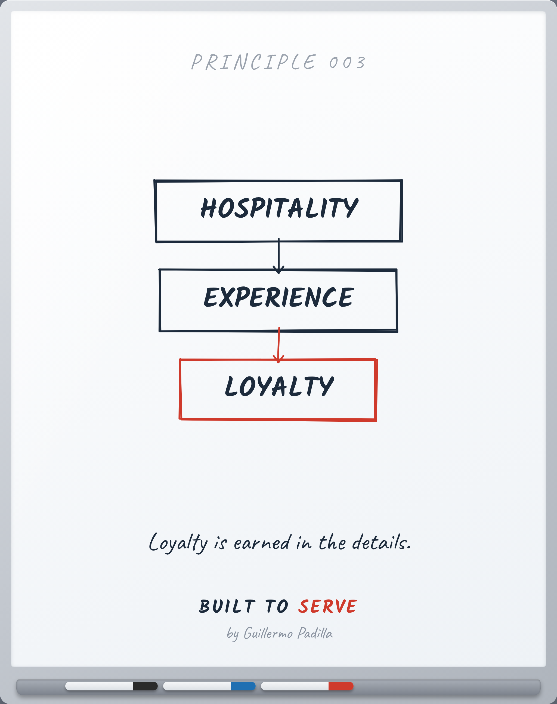

# PRINCIPLE 003 — Hospitality → Experience → Loyalty

> Loyalty is earned in the details.

- **Canon:** Principle 003
- **Pilar:** Hospitalidad
- **Parte:** IV Operaciones (Experiencia del cliente)
- **Representación visual:** whiteboard del mismo número

## Caption (LinkedIn · ES)

> Voz: abre con una verdad universal sobre el lector. La historia personal,
> si la hay, va después.

La gente no vuelve por los descuentos.
Vuelve por cómo la hiciste sentir.

La hospitalidad genuina crea una experiencia.
La experiencia, repetida, crea lealtad.

Y la lealtad no se compra:
se gana en los detalles que nadie te exige.

La gente olvida lo que le vendiste.
Recuerda cómo la trataste.

¿Cuál fue el último detalle que sorprendió a tu cliente?

#Hospitalidad #Experiencia #BuiltToServe

---

<!-- The Principle Test: 1 Atemporal · 2 Experiencia real · 3 Enseñable ·
4 Dibujable en pizarra · 5 Resumible en una frase · 6 Mejores profesionales ·
7 Fortalece Built to Serve -->
