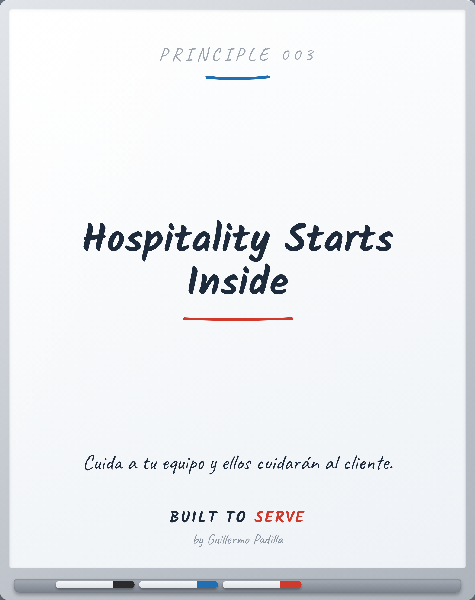

# PRINCIPLE 003 — Hospitality Starts Inside

> *Hospitality Starts Inside*
> Cuida a tu equipo y ellos cuidarán al cliente.

- **Canon:** Principle 003
- **Pilar:** Hospitalidad
- **Parte:** II Los Cuatro Pilares (Hospitalidad)
- **Estado:** Publicable

## Caption (LinkedIn · ES)

El cliente siente, exacto, cómo tratas a tu equipo.
Ni más, ni menos.

No puedes dar hacia afuera lo que no diste adentro.

Sirve a tu gente primero.
El resto se desborda solo hacia la mesa.

¿Qué hiciste hoy por la persona que atiende a tu cliente?

#Hospitalidad #Liderazgo #BuiltToServe

---

<!-- Las siete puertas: 1 Atemporal · 2 Práctico · 3 Enseñable ·
4 Consistente · 5 Mejores líderes · 6 Mejores profesionales · 7 Importa en 10 años -->
