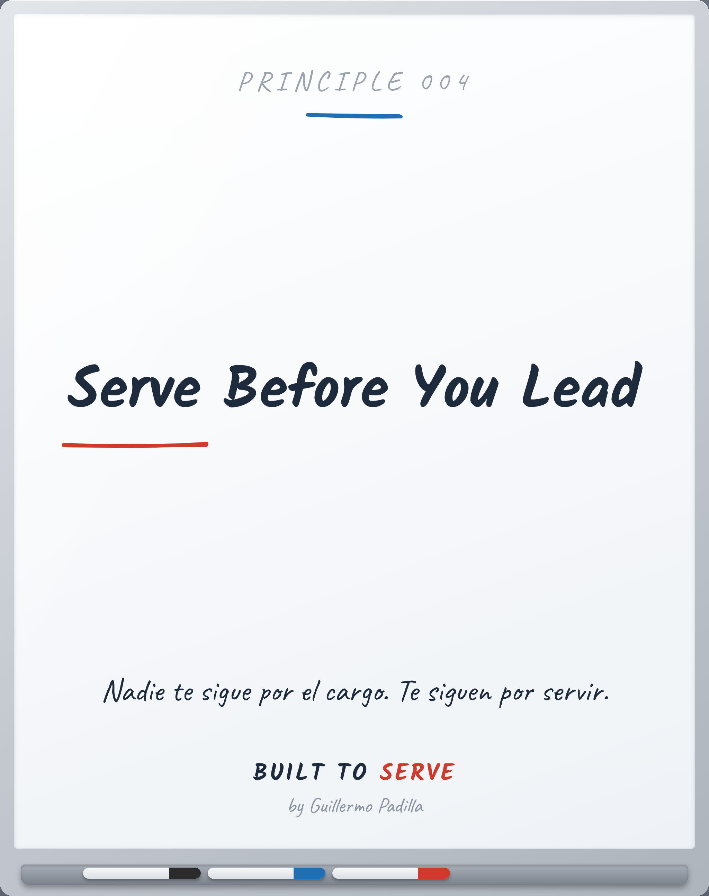

# PRINCIPLE 004 — Serve Before You Lead

> *Serve Before You Lead*
> Nadie te sigue por el cargo. Te siguen por servir.

- **Canon:** Principle 004
- **Pilar:** Hospitalidad
- **Parte:** III Liderazgo
- **Estado:** Publicable

## Caption (LinkedIn · ES)

El liderazgo no es un cargo. Es una consecuencia.

Primero sirves.
Servir gana confianza.
La confianza es lo que hace que te sigan.

Nadie sigue un título. Siguen a alguien que se ganó el derecho.

¿Te estás ganando el derecho a liderar, o solo el cargo?

#Liderazgo #Servicio #BuiltToServe

---

<!-- Las siete puertas: 1 Atemporal · 2 Práctico · 3 Enseñable ·
4 Consistente · 5 Mejores líderes · 6 Mejores profesionales · 7 Importa en 10 años -->
