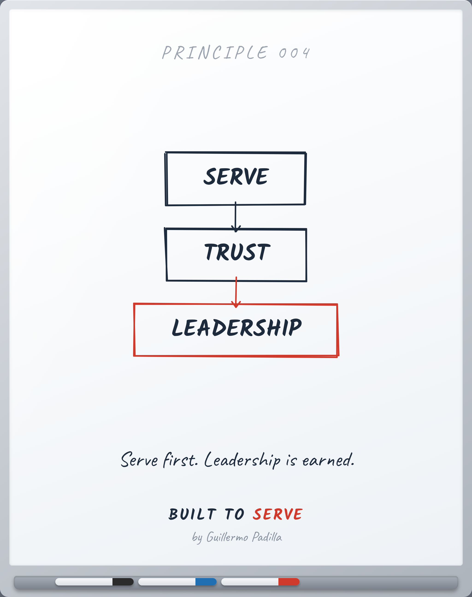

# PRINCIPLE 004 — Servir → Confianza → Liderazgo

> Primero sirves. El liderazgo se gana.

- **Canon:** Principle 004
- **Nace de:** AXIOM 002 (El liderazgo es servicio)
- **Pilar:** Hospitalidad
- **Parte:** III Liderazgo
- **Representación visual:** whiteboard del mismo número (nodos en inglés, resumen en español)

## Caption (LinkedIn · ES)

> Voz: abre con una verdad universal sobre el lector. La historia personal,
> si la hay, va después.

Muchos creen que el liderazgo empieza con un cargo.

Empieza mucho antes. Empieza sirviendo.

Servir construye confianza.
La confianza es lo único que hace que alguien te siga.

Nadie sigue un título.
Siguen a alguien que se ganó el derecho.

El liderazgo no se nombra. Se gana.

¿Te estás ganando el derecho a liderar, o solo el puesto?

#Liderazgo #Servicio #BuiltToServe

---

<!-- The Principle Test: 1 Atemporal · 2 Experiencia real · 3 Enseñable ·
4 Dibujable en pizarra · 5 Resumible en una frase · 6 Mejores profesionales ·
7 Fortalece Built to Serve -->
