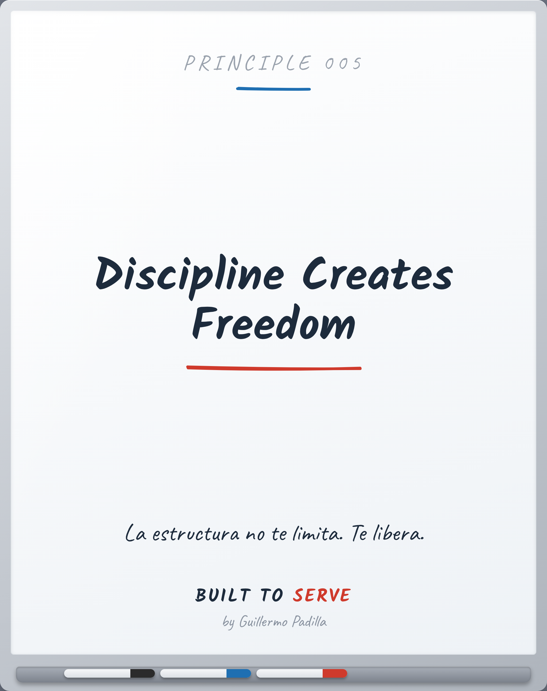

# PRINCIPLE 005 — Discipline Creates Freedom

> *Discipline Creates Freedom*
> La estructura no te limita. Te libera.

- **Canon:** Principle 005
- **Pilar:** Disciplina
- **Parte:** V Crecimiento Personal
- **Estado:** Publicable

## Caption (LinkedIn · ES)

Creemos que la disciplina nos limita.
Es al revés.

La disciplina de hoy es la libertad de mañana.
El que entrena, elige.
El que improvisa, reacciona.

La estructura no es una jaula. Es lo que te da espacio para volar.

¿Qué disciplina pequeña te daría más libertad en seis meses?

#Disciplina #BuiltToServe

---

<!-- Las siete puertas: 1 Atemporal · 2 Práctico · 3 Enseñable ·
4 Consistente · 5 Mejores líderes · 6 Mejores profesionales · 7 Importa en 10 años -->
