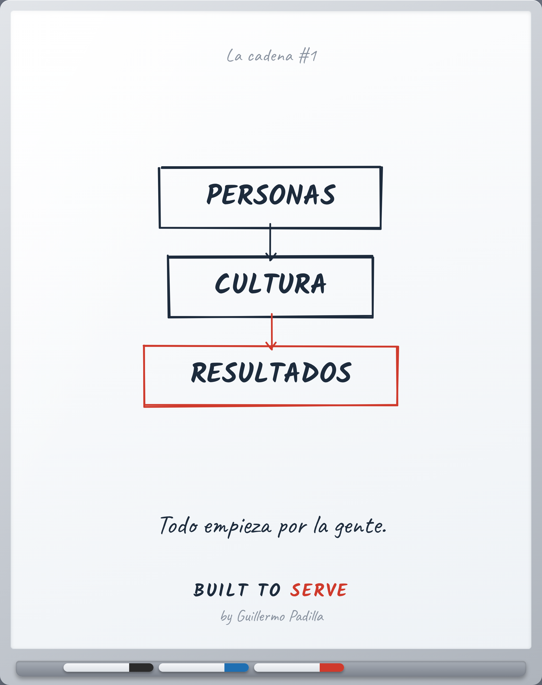
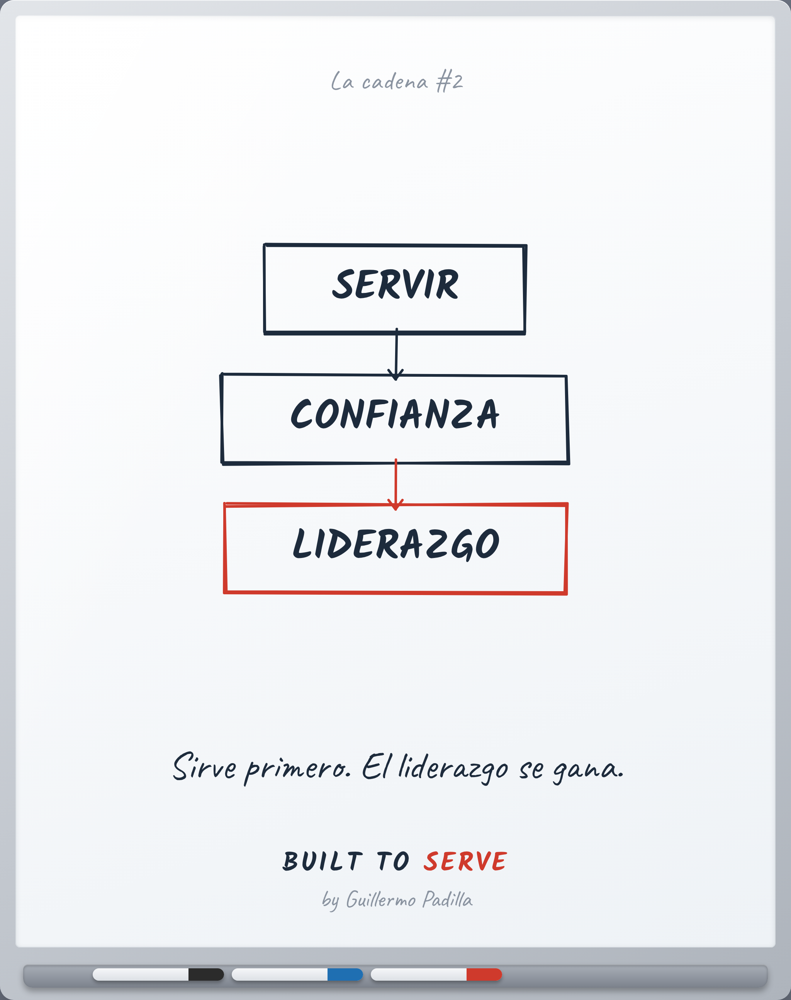
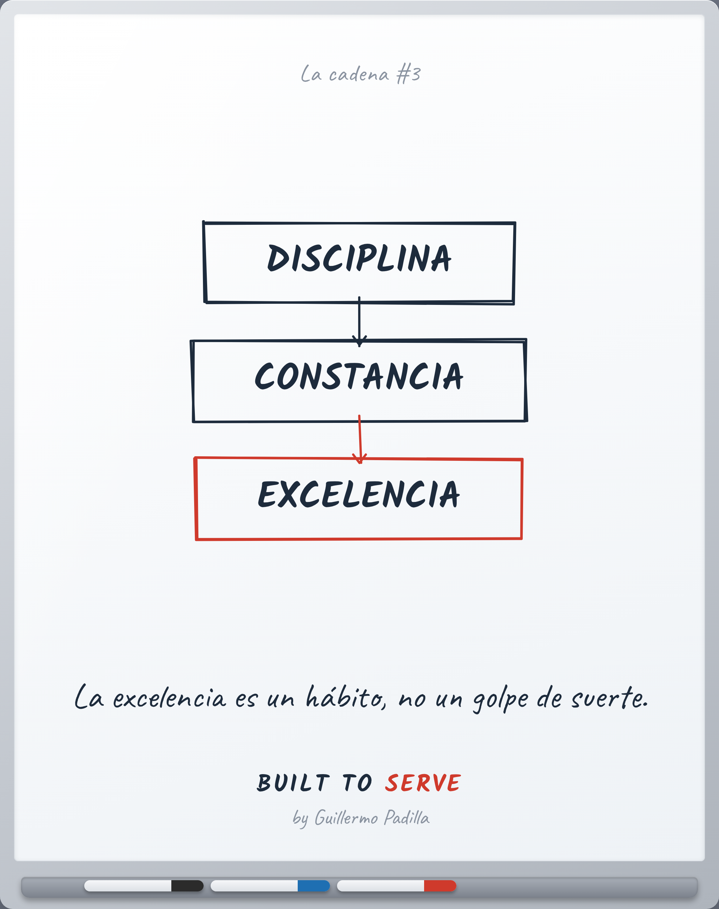
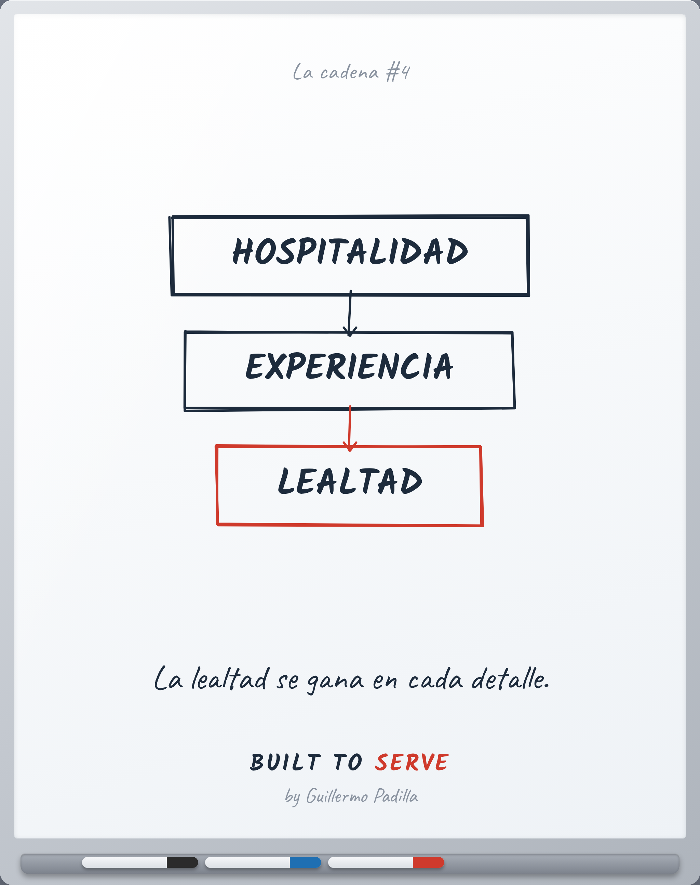

# Serie — Las Cadenas

> Diagramas mentales, no listas. Cada cadena es una relación causa → efecto
> que se entiende en tres segundos. El último nodo (el resultado) va en rojo.

Una serie visual recurrente para LinkedIn. Mismo formato pizarrón, misma
lógica de tres nodos, misma firma. Reconocible a primera vista.

> Firma: **Built to Serve** (protagonista) · *by Guillermo Padilla* (fundador).
> La filosofía es la marca; el fundador la sostiene.

---

## Cadena #1 — Personas → Cultura → Resultados
**Pilar:** Hospitalidad · **Parte:** I Fundamentos (Cultura)
**Cierre:** *Todo empieza por la gente.*

## Cadena #2 — Servir → Confianza → Liderazgo
**Pilar:** Hospitalidad · **Parte:** III Liderazgo
**Cierre:** *Sirve primero. El liderazgo se gana.*

## Cadena #3 — Disciplina → Constancia → Excelencia
**Pilar:** Disciplina · **Parte:** V Crecimiento Personal
**Cierre:** *La excelencia es un hábito, no un golpe de suerte.*

## Cadena #4 — Hospitalidad → Experiencia → Lealtad
**Pilar:** Hospitalidad · **Parte:** IV Operaciones (Experiencia del cliente)
**Cierre:** *La lealtad se gana en cada detalle.*

---

## Cómo crece la serie

Cada nueva cadena es un nodo → nodo → resultado que refuerza un principio de
Built to Serve. Para agregar una, edita la lista `SERIE` en
[`../tools/graphics/gen.py`](../tools/graphics/gen.py) y regenera.

Ideas para las próximas (deben pasar las siete puertas del Archivist):

- Detalle → Estándar → Reputación
- Empatía → Conexión → Servicio
- Hábito → Identidad → Carácter
- Preparación → Calma → Ejecución
